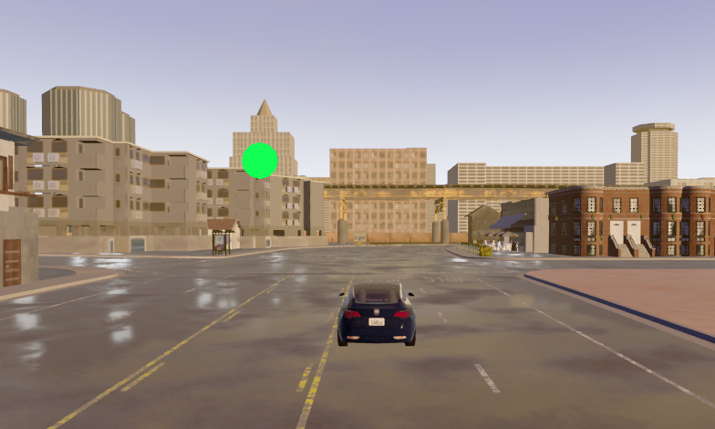

# Introducción

Este simulador, tomando como base el proyecto [CARLA](http://carla.org/), busca dar una herramienta a los desarrolladores de aplicaciones para automóviles que les permita probar, en un ambiente controlado, el nivel de carga cognitiva de los conductores mientras utilizan sus aplicaciones.

Las tareas de detección-respuesta (DRT) son un método para evaluar los efectos atencionales de la carga cognitiva en un entorno de conducción. Dependiendo de la eficiencia conseguida al realizar estas tareas, junto con la calidad de manejo que posee el conductor mientras las realiza, podemos sacar conclusiones sobre el trabajo mental que le lleva realizar las dos cosas a la vez.

Para fines prácticos podemos pensar que la tarea que debe realizar el conductor en este caso es utilizar una aplicación del celular o del panel frontal de un auto. A medida que el conductor maneja es necesario saber si nuestra app distrae mucho al conductor y que partes de nuestra app los distraen más.


## Instalación:

> Se recomienda usar un entorno virtual para la instalación de las dependencias.

```sh
  git clone git@github.com:Proyecto-tesina/carla_simulator.git
  cd carla_simulator
  mkdir Carla
  wget http://carla-assets-internal.s3.amazonaws.com/Releases/Linux/CARLA_0.9.6.tar.gz
  tar -xvzf CARLA_0.9.6.tar.gz -C Carla
```

## Uso:
> *Adentro del repositorio*

Primero se debe iniciar el servidor de carla
```sh
  ./Carla/Carla.sh  # Se puede pasar el parámetro "-quality-level=Low" para mejorar el rendimiento
```
Luego iniciar la simulación junto con el detector de rostros
```sh
  python3 simulator/app.py
  python3 face_detection_on_webcam.py
```

## Parámetros
Existen algunos parámetros que nos permiten configurar como se ejecuta la simulación:
```sh
-a --autopilot        # Activa el piloto automático
-w --wheel            # Configura la simulación para recibir eventos del volante
-p --port "2000"      # Puerto TCP en el que escucha
--host "127.0.0.1"    # IP del host con el servidor de CARLA
--rolename "name"     # Permite modificar el nombre del actor bajo control. Por defecto es: hero
--res "1280x720"      # Configura la resolución de la simulación
--multimonitor        # Configuración en pantalla completa, ocupa todos los monitores disponibles
```

<br>

# Organización del Proyecto

El simulador provee una serie de hooks que facilitan la implementación de componentes u objetos que se encarguen de controlar, monitorear o agregarle funcionalidad a la simulación. Hasta este momento el simulador cuenta con dos componentes, PlayerMonitor y AlertLight.

PlayerMonitor se encarga de recopilar información sobre las actividades que realiza el conductor durante la simulación y enviar esa información a un [servidor](https://github.com/Proyecto-tesina/server-rest) para su posterior consumo.

```python
            {
                'timestamp': "2020-08-22T19:33:09.176403Z",
                'status': "Moving forward",
            }
```


AlertLight provee elementos para ejercitar las tareas de detección-respuesta (DRT). Este componente permite dibujar luces en la pantalla que actuan como agente distractor del conductor.



Se pueden configurar las luces para que aparezcan de diferente tamaño, con distinta frequencia e incluso se pueden seleccionar ubicaciones especificas de la pantalla donde puede aparecer.

## Hooks

Agregar un nuevo componente es tan sencillo como instanciar un objeto y suscribirlo al World del simulador.

El objeto World está atento a los eventos que suceden en el servidor en el que corre el simulador, mantiene información sobre el jugador y se encarga de pasar esa información a los componentes que se suscriben a él. Para esto existen dos listas de suscripción.

### tick_subscribers
Para los objetos contenidos en esta lista se espera una implementación del método tick().

```python
    def tick(self, world, clock):
        pass
```

Este método es llamado por cada frame de la simulación y se le pasa como parámetro el objeto World junto con el Clock usado por la simulación para sincronizar eventos.


### render_subscribers
Para los objetos en esta lista se espera una implementación del método render().

```python
    def render(self, display):
        pass
```

En este método se recibe como parámetro un display sobre el cual se pueden dibujar y controlar elementos que se muestran en pantalla.

### key_events
Además en caso de que los componentes sean interactivos y necesiten estar pendientes de eventos del teclado se puede registrar un callback bajo una tecla específica en el controller como se muestra en la imagen.

> Las teclas se registran bajo el código de letra que proporciona Pygame

```python
# app.py

    def _init_components(self):
        player_monitor = PlayerMonitor()
        alert_light = AlertLight(*self.resolution.size())

        self.world.add_tick_subscriber(player_monitor)
        self.world.add_render_subscriber(alert_light)

        self.controller.register_event(K_n, alert_light.turn_on_by_user)
        self.controller.register_event(K_b, alert_light.turn_off_by_user)
```

Se puede observar también como se agregan los componentes nuevos a las listas de eventos del World
